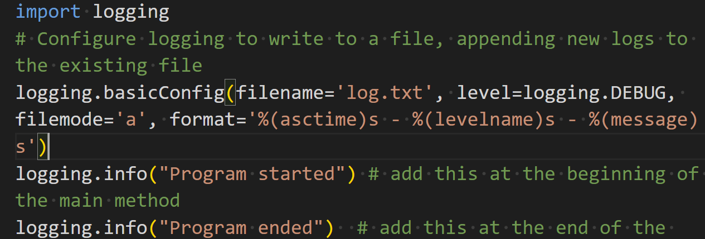
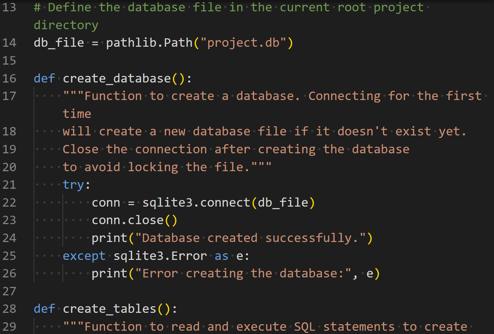
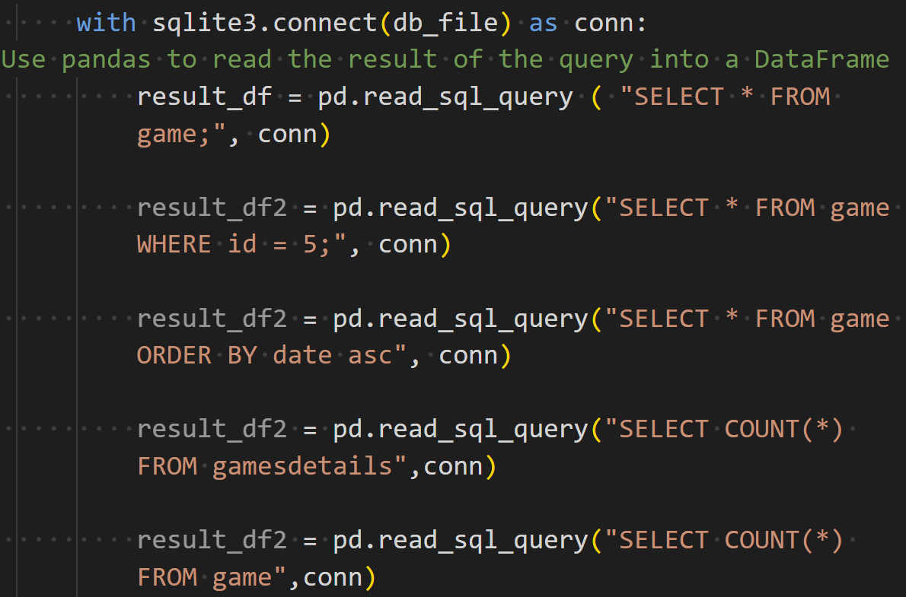
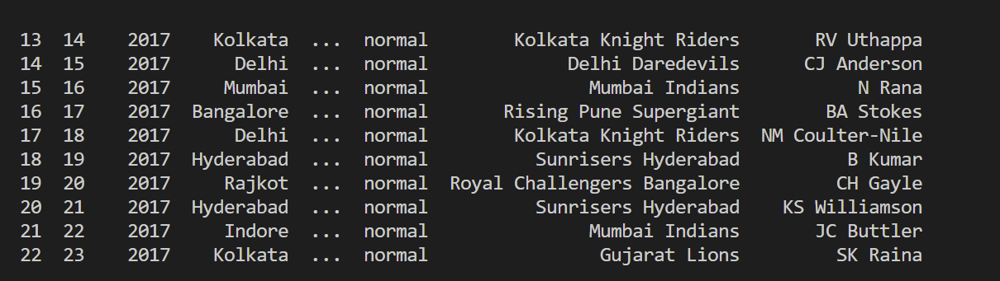

 Overview
 # DATAFUN-05-SQL
 Created  By Priyanka Naskar
 Date - 2/9/2024
Project 5 integrates Python and SQL, focusing on database interactions using SQLite. This project introduces logging, a useful tool for debugging and monitoring projects, and involves creating and managing a database, building a schema, and performing various SQL operations, including queries with joins, filters, and aggregations.

# Deliverable Names

GitHub Repository: DATAFUN-05-SQL
Documentation: README.md
Initialize script: db_initialize_priyanka.py
Operations script: db_operations_priyanka.py

# Module 5 Repository
Steps to create project
Start a new project in GitHub and clone down into VS Code
Create Virtual Environment
python3 -m venv .venv .venv\bin\activate python3 -m pip install -r requirements.txt

# Add folders
Add requirements.txt
Add .gitignore file
Import Dependencies
python3 -m pip install pandas python3 -m pip install pyarrow python3 -m pip install seaborn python3 -m pip install scipy

Freeze Dependencies
python3 -m pip freeze > requirements.txt
 
# Create folder "data"
Create file under "data" with .csv extension
1 authors.csv
2 books.csv
3 game.csv
4 gamesdetail.csv

# External Dependencies
pandas
pyarrow

# Environment Setup
Push to GitHub
git add . git commit -m "initial commit" git push origin main

# Logging

logging.basicConfig(filename='log.txt', level=logging.DEBUG, filemode='a', format='%(asctime)s - %(levelname)s - %(message)s')

logging.info("Program started") # add this at the beginning of the main method
logging.info("Program ended")  # add this at the end of the main method
 # Schema Design and Database Creation
 
def create_database():
    """Function to create a database. Connecting for the first time
    will create a new database file if it doesn't exist yet.
    Close the connection after creating the database
    to avoid locking the file."""
    try:
        conn = sqlite3.connect(db_file)
        conn.close()
        print("Database created successfully.")
    except sqlite3.Error as e:
        print("Error creating the database:", e)

def create_tables():
    """Function to read and execute SQL statements to create tables"""
    try:
        with sqlite3.connect(db_file) as conn:
            sql_file = pathlib.Path("sql", "create_tables.sql")
            with open(sql_file, "r") as file:
                sql_script = file.read()
            conn.executescript(sql_script)
            print("Tables created successfully.")
    except sqlite3.Error as e:
        print("Error creating tables:", e)

def insert_data_from_csv():
    """Function to use pandas to read data from CSV files (in 'data' folder)
    and insert the records into their respective tables."""
    try:
        author_data_path = pathlib.Path("data", "authors.csv")
        book_data_path = pathlib.Path("data", "books.csv")
        authors_df = pd.read_csv(author_data_path)
        books_df = pd.read_csv(book_data_path)
        with sqlite3.connect(db_file) as conn:
 # use the pandas DataFrame to_sql() method to insert data
 # pass in the table name and the connection
            authors_df.to_sql("authors", conn, if_exists="replace", index=False)
            books_df.to_sql("books", conn, if_exists="replace", index=False)
            print("Data inserted successfully.")
    except (sqlite3.Error, pd.errors.EmptyDataError, FileNotFoundError) as e:
        print("Error inserting data:", e)

def main():
    create_database()
    create_tables()
    insert_data_from_csv()

if __name__ == "__main__":
    main()

# SQL Operations

import sqlite3

def execute_sql_from_file(db_filepath, sql_file):
    with sqlite3.connect(db_filepath) as conn:
        with open(sql_file, 'r') as file:
            sql_script = file.read()
        conn.executescript(sql_script)
        print(f"Executed SQL from {sql_file}")

def main():
    db_filepath = 'your_database.db'

    # Create database schema and populate with data
    execute_sql_from_file(db_filepath, 'insert_records.sql')
    execute_sql_from_file(db_filepath, 'update_records.sql')
    execute_sql_from_file(db_filepath, 'delete_records.sql')
    execute_sql_from_file(db_filepath, 'query_aggregation.sql')
    execute_sql_from_file(db_filepath, 'query_filter.sql')
    execute_sql_from_file(db_filepath, 'query_sorting.sql')
    execute_sql_from_file(db_filepath, 'query_group_by.sql')
    execute_sql_from_file(db_filepath, 'query_join.sql')

    logging.info("All SQL operations completed successfully")

 # Script Execution
 

 # git add. 
 # git commit "initial commit"
 # git push origin main 
 
